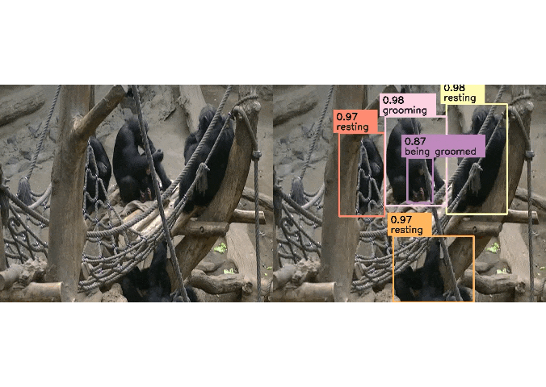

<div align="center">

  <h1 align="center">AlphaChimp: Tracking and Behavior Recognition of Chimpanzees</h1>
  
</div>

<!-- # Introduction -->

<!-- This is the offical [Pytorch](https://pytorch.org/) implementation of our paper: -->
<h3 align="center">AlphaChimp: Tracking and Behavior Recognition of Chimpanzees</h3>

<h4 align="center" style="text-decoration: none;">
  <a href="https://shirleymaxx.github.io/", target="_blank">Xiaoxuan Ma</a><sup>*</sup>
  ,
  <a href="https://github.com/Yutang-Lin", target="_blank">Yutang Lin</a><sup>*</sup>
  ,
  <a href="https://xy02-05.github.io/", target="_blank">Yuan Xu</a>
  ,
  <a href="https://carta.anthropogeny.org/users/stephan-kaufhold", target="_blank">Stephan P. Kaufhold</a><sup></sup>
  ,
  <a href="http://jackterwilliger.com/", target="_blank">Jack Terwilliger</a>
  ,
  <a href="https://www.linkedin.com/in/andy-meza-9bb064213/", target="_blank">Andres Meza</a>
  ,
  <a href="https://yzhu.io/", target="_blank">Yixin Zhu</a>
  ,
  <a href="https://cogsci.ucsd.edu/people/faculty/federico-rossano.html", target="_blank">Federico Rossano</a>
  ,
  <a href="https://cfcs.pku.edu.cn/english/people/faculty/yizhouwang/index.htm", target="_blank">Yizhou Wang</a>
</h4>
<h4 align="center">
  <a href="https://sites.google.com/view/alphachimp/home", target="_blank">[project page]</a> /
  <a href="https://shirleymaxx.github.io/ChimpACT/", target="_blank">[ChimpACT dataset]</a>
</h4>

<p align="center">
  
</p>


# Code coming soon...


<!-- # Citation
```bibtex
@article{ma2024alphachimp,
    title={AlphaChimp: Tracking and Behavior Recognition of Chimpanzees},
    author={Ma, Xiaoxuan and Lin, Yutang and Xu, Yuan and Kaufhold, Stephan and Terwilliger, Jack and Meza, Andres and Zhu, Yixin and Rossano, Federico and Wang, Yizhou},
    journal={arXiv preprint arXiv},
    year={2024}
}
``` -->

<!-- # Acknowledgement
This repo is built on the excellent work [MMTracking](https://github.com/open-mmlab/mmtracking), [MMPose](https://github.com/open-mmlab/mmpose), and [MMAction2](https://github.com/open-mmlab/mmaction2). Thanks for these great projects. -->
